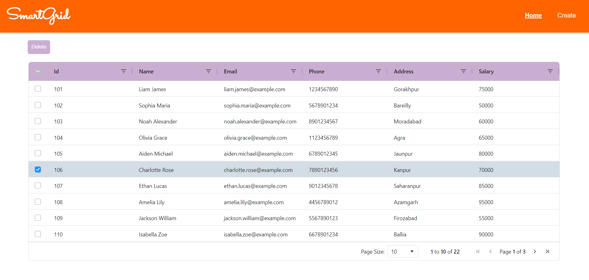

# SmartGrid

A basic full-stack employee management application built with modern technologies. Manage employee records with an intuitive interface featuring real-time data grid updates, inline editing, and professional report generation.

## 🎯 Features

- **Employee Management**: Create, read, update, and delete employee records
- **Real-time Grid**: Interactive AG-Grid with sorting, filtering, and pagination
- **Inline Editing**: Edit employee information directly in the grid
- **Data Export**: Generate professional PowerPoint reports with summary statistics
- **Secure API**: Comprehensive input validation and error handling

## Snapshot📸


## 🛠️ Tech Stack

| Layer | Technologies |
|-------|---|
| **Frontend** | Angular 17, AG-Grid, TypeScript, RxJS |
| **Backend** | Python, Flask, PyMongo |
| **Database** | MongoDB Atlas (Cloud) |
| **Deployment** | Vercel (Frontend), Render (Backend) |

## 📋 Prerequisites

- **Node.js 16+** and **npm**
- **Python 3.8+**
- **MongoDB Atlas account** (free tier)
- **Git** for version control

## 🚀 Quick Start

### Backend Setup

```bash
# Clone repository
git clone https://github.com/alokverma18/SmartGrid.git
cd SmartGrid/Backend

# Create virtual environment
python -m venv venv
venv\Scripts\activate  # Windows
# or
source venv/bin/activate  # macOS/Linux

# Install dependencies
pip install -r requirements.txt

# Configure .env
MONGODB_URI=mongodb+srv://<username>:<password>@<cluster>.mongodb.net/smartgrid

# Test connection
python check.py

# Start server
python main.py
```

Server runs on `http://localhost:5000`

### Frontend Setup

```bash
# In new terminal, from root directory
cd SmartGrid
npm install
npm start
```

Application runs on `http://localhost:4200`

## 📁 Quick Project Overview

```
SmartGrid/
├── Backend/
│   ├── main.py              # API routes
│   ├── config.py            # MongoDB config
│   ├── validators.py        # Input validation
│   ├── requirements.txt     # Dependencies
│   └── .env                 # Environment variables
├── src/
│   └── app/Components/      # Angular components
├── package.json             # Frontend dependencies
└── README.md / LEARN.md     # Documentation
```

## 🔌 API Overview

| Method | Endpoint | Purpose |
|--------|----------|---------|
| GET | `/employee` | Get all employees |
| GET | `/employee/<id>` | Get single employee |
| POST | `/employee/create` | Create employee |
| PUT | `/employee/update` | Update employee |
| DELETE | `/employee/delete/<id>` | Delete employee |

## 🌐 Deployment

### Frontend: Vercel
- Connect GitHub repo → Select Angular preset → Auto-deploy on push
- **URL**: `yourproject.vercel.app`

### Backend: Render
- Create `Backend/Procfile`: `web: gunicorn app:app --chdir Backend`
- Connect GitHub → Set env vars (MONGODB_URI) → Auto-deploy
- **URL**: `yourproject.onrender.com`

### Database: MongoDB Atlas
- Create free M0 cluster
- Configure IP whitelist
- Get connection string

For detailed deployment instructions, see [LEARN.md](LEARN.md).

## 📊 Sample Data

Populate database with test data:

```bash
cd Backend
python seed_data.py
```

## 🔒 Security

- ✅ Input validation (frontend & backend)
- ✅ NoSQL injection prevention
- ✅ Type safety with TypeScript
- ✅ CORS protection
- ✅ Generic error messages

## 📚 Documentation

- **[LEARN.md](LEARN.md)** - In-depth architecture, components, validation, and deployment guide
- **[.env.example](Backend/.env.example)** - Environment variables template

## 🧪 Testing API

```bash
# Get all employees
curl http://localhost:5000/employee

# Create employee
curl -X POST http://localhost:5000/employee/create \
  -H "Content-Type: application/json" \
  -d '{"name":"John Doe","email":"john@example.com","phone":"1234567890","address":"123 Main St","salary":55000}'
```

## 🐛 Troubleshooting

| Issue | Solution |
|-------|----------|
| MongoDB connection error | Check Atlas IP whitelist and connection string |
| API 400 errors | Verify input validation (email format, salary range) |
| CORS errors | Ensure backend is running with CORS enabled |
| Build errors | Delete `node_modules` and run `npm install` again |

More troubleshooting in [LEARN.md](LEARN.md).

## 🤝 Contributing

Contributions welcome! Feel free to:
- Report bugs
- Suggest features
- Submit pull requests

## 📝 License

MIT License - feel free to use this project for learning and development.

## Connect🌐
[](https://www.linkedin.com/in/alokverma18/)

### Leave a 🌟 if you like it!

---
### Thank You!
